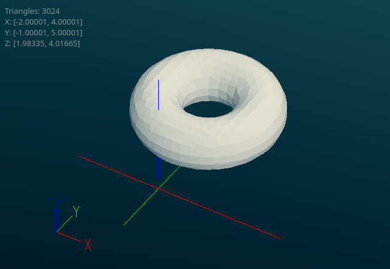

# FidgetPy

Python bindings and high-level API for [Fidget](https://github.com/mkeeter/fidget).

## Usage

``` python
Python 3.11.2 (main, Nov 30 2024, 21:22:50) [GCC 12.2.0] on linux
Type "help", "copyright", "credits" or "license" for more information.
>>> 
>>> # low level API, manipulating vectors and math expressions directly
>>> from fidgetpy.math import axes
>>> p = axes()
>>> sphere = p.length() - 1.0  # radius 1
>>> mesh = sphere.mesh(5, 0, 0, 0, 2.0)
>>> print(f"mesh has {len(mesh.triangles)} tris and {len(mesh.vertices)} verts.")
mesh has 4632 tris and 2318 verts.
>>> 
>>> # high level API, using premade 2D and 3D shapes
>>> from fidgetpy.shapes import torus, move
>>> tor = torus(2.0, 1.0)
>>> # shape objects have preset bounding boxes for automatic meshing
>>> tor.bounds
BoundBox(xmin=-3.0, xmax=3.0, ymin=-3.0, ymax=3.0, zmin=-1.0, zmax=1.0)
>>> tor = move(tor, 1.0, 2.0, 3.0)
>>> tor.bounds
BoundBox(xmin=-2.0, xmax=4.0, ymin=-1.0, ymax=5.0, zmin=2.0, zmax=4.0)
>>> with open("./torus.stl", 'wb') as f:
...     f.write(tor.mesh(5).to_stl())
... 
151284
>>> 
```



Refer to the [examples](examples/README.md) folder for additonal usage details.
